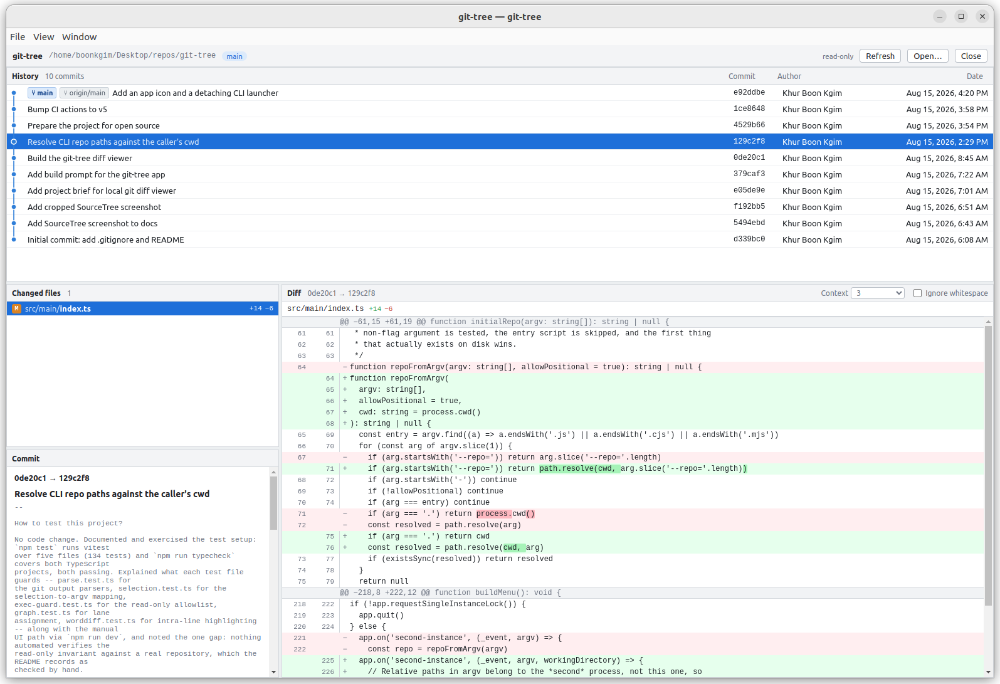
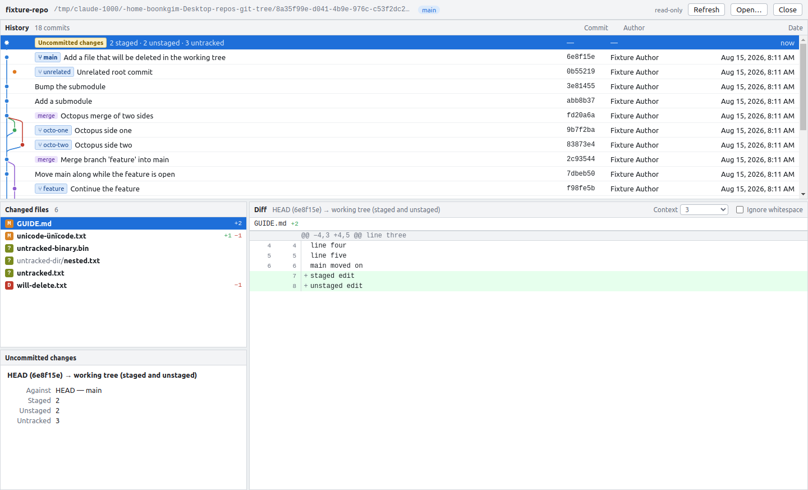

# git-tree

[](https://github.com/boonkgim/git-tree/actions/workflows/ci.yml)
[](LICENSE)
[](https://nodejs.org)

A desktop viewer for the history and diffs of a local Git repository. Four panels — commit
graph, changed files, commit metadata, diff — laid out like SourceTree, with a branch sidebar
beside them.

It is **view-only**. It never stages, commits, checks out, discards, stashes, fetches, pushes,
or writes anything to your working tree, index, or object store.


*git-tree viewing its own history, with a commit selected against its parent: the changed file,
the commit message, and a diff with intra-line highlighting.*


*The uncommitted-changes row selected — staged and unstaged together — against a fixture
repository. The layout follows `docs/01-sourcetree-cropped.png`.*

---

## Prerequisites

- **Node.js 20 or newer** (developed on 24) and npm, to build and run.
- **Git 2.11 or newer** on your `PATH`. The app shells out to your own `git`; if it is missing
  or too old you get a plain message saying so at start-up rather than an empty window.
- Linux, Windows, or macOS.

## Installing

On Linux, install the `.deb` from `release/` (or the [releases page]). That is what registers
git-tree with the desktop the way any other application is registered — it unpacks to
`/opt/git-tree`, installs `/usr/share/applications/git-tree.desktop` and the hicolor icons, and
links `/usr/bin/git-tree`. The app then appears in **Show Applications** / your launcher and
searches under "git" or "diff".

```bash
sudo dpkg -i release/git-tree-0.1.0-linux-amd64.deb
```

The AppImage is the portable alternative: one self-contained file that installs and registers
*nothing*, by design. It runs when executed but will never show up in the applications list,
and it gets none of the terminal behaviour described below, so prefer the `.deb` unless you
specifically want a no-install binary.

[releases page]: https://github.com/boonkgim/git-tree/releases

## Running it

```bash
npm install
npm run dev                                       # opens the repository picker
GIT_TREE_REPO=/path/to/repository npm run dev     # opens a repository straight away
```

(The environment variable is used in development because `electron-vite` consumes unrecognised
command-line flags before they reach the app.)

Once installed, the command takes a path directly:

```bash
git-tree /path/to/repository
git-tree .
```

The command returns to the prompt immediately. `/usr/bin/git-tree` is a small wrapper
(`build/linux/git-tree-launcher`) that starts the application in its own session, so it does
not hold the terminal, does not print Chromium's diagnostics into it, and survives both
`Ctrl+C` and closing the terminal — the same arrangement VS Code's `code` uses. A relative path
is still resolved against the directory you ran the command in.

A repository can also be opened from **File → Open Repository…** (`Ctrl/Cmd+O`), from the
recent list on the welcome screen, or by dropping a folder onto the window. Any path *inside* a
repository works — it is resolved with `git rev-parse --show-toplevel`.

Other commands:

```bash
npm test          # unit tests
npm run typecheck # both TypeScript projects
npm run build     # bundle main, preload and renderer into out/
```

## Building distributables

```bash
npm run build:linux   # AppImage + .deb   -> release/
npm run build:win     # NSIS installer    -> release/
npm run build:mac     # .dmg              -> release/
npm run build:all     # all three
```

Icons come from `build/icons/` (generated from `build/icon.svg`, a commit graph in the app's
own lane colours), so the packages carry the full hicolor set rather than Electron's default.
Builds are unsigned — macOS and Windows will warn about an unidentified developer.

electron-builder only cross-builds so far in practice: Windows and macOS targets are best built
on their own platforms (macOS in particular requires macOS for signing). Linux was the platform
this was developed and packaged on.

## Using it

| Action | Result |
|---|---|
| Click a commit | Its diff against its parent |
| Click **Uncommitted changes** | The working tree against `HEAD`, staged *and* unstaged |
| `Ctrl/Cmd+Click` a second row | The diff between the two selected rows |
| `Ctrl/Cmd+Click` a selected row | Removes it from the selection |
| Click, plain | Collapses back to a single selection |
| `↑` / `↓` | Move the selection |
| **Flat** / **Tree** in the changed-files header | Switch between one row per file and a directory tree |
| Select an image, video or sound file | Both sides are previewed in the diff panel instead of a byte count |
| Double-click a file row | Opens the working-tree file in your desktop's default application |
| Click a folder row | Fold it shut; the header's ⊟ / ⊞ folds or opens all of them |
| The folder button on a folder row | Opens that directory in your desktop's file manager |
| Click a branch, remote or tag in the sidebar | Moves the history to the commit it points at |
| Type in the sidebar's filter, then `Enter` | Jumps to the first match; `Esc` clears the filter |
| `Ctrl/Cmd+B` | Show or hide the sidebar |
| `F5` | Refresh |

The diff panel always states the comparison it is showing in words, so it is never ambiguous
which side is "before".

---

## Design decisions

The brief left these open. Here is what was chosen and why.

### The selection model

**The pair is order-insensitive.** Selecting A then B and B then A produce the same diff. Which
side is "before" is decided by topology first — `git merge-base --is-ancestor` — and only falls
back to commit date when neither commit reaches the other. That case is labelled *"diverged
branches, ordered by date"*, and commits with no common ancestor at all are labelled *"no common
ancestor, direct tree comparison"*, because a plain diff between them is still meaningful even
though a range is not.

**The working tree is always the newer side.** Pairing it with any commit shows that commit →
the working tree. It represents the state that exists *now*, so treating it as older than a
2019 commit would be the only reading that is never useful.

**A third `Ctrl/Cmd+Click` keeps the anchor pinned** and moves the other end. The anchor is
marked with a yellow bar. This makes sweeping several commits against one fixed reference the
natural gesture, which is the common reason to keep clicking.

**The selection is never empty.** `Ctrl/Cmd+Click`ing the only selected row is a no-op, because
an empty selection would just blank three panels.

**A merge commit defaults to its first parent**, labelled `parent 1 of N`, with a selector in the
diff header to switch. Combined (`-c`) diffs were left out: they are hard to read and easy to
misinterpret, and picking a parent answers "what did this merge bring in" more directly.

**The root commit is diffed against the empty tree**, so it shows as every file added. The empty
tree's id is asked of the repository via `git hash-object -t tree --stdin` rather than hard-coded,
so SHA-256 repositories work too. (`hash-object` without `-w` computes an id and writes nothing.)

**The uncommitted-changes row is hidden when the working tree is clean**, matching SourceTree. If
it was selected and the tree becomes clean, the selection falls back to `HEAD`.

**With a clean tree the default selection is `HEAD`**, not the newest commit by date — with a
detached `HEAD`, or a branch behind another, the top row is not where you are.

### The changed-file list

**Two layouts, because neither is right for every change.** The flat list is exactly what Git
reported, in Git's order, and it is the better one for a commit touching five files — the full
path on every row, nothing to unfold. A rename across forty files in a dozen directories is the
opposite case: there the shared prefixes are most of the pixels and none of the information, so
the tree groups them and spends the width on the names instead. The choice is a toggle in the
panel header, persisted like the diff options.

**Directories that hold nothing but one more directory are folded into a single row**
(`src/renderer/components`, not three rows of indentation). Repositories are full of these
chains, and a row per empty level costs indentation and gives nothing back.

**Folding is by path, so it survives moving between commits** — the directories someone has
chosen to ignore are usually the same ones in the next comparison. The selected file is revealed
when the selection moves, but never when the folded set itself changes, so folding shut the
directory you are looking at does not spring straight back open.

**Double-click opens the file; folders get a button.** Reading a diff and then wanting the file
itself — in an editor, an image viewer, a PDF reader — is the commonest thing this application
cannot do for you, and handing the path to the desktop is one line rather than a second file
manager. Double-click is the gesture every file list already uses, so a single click still only
selects. A folder row has no equivalent gesture that is not already taken by folding, so it gets
a small button instead, shown when the pointer is over the row.

**What opens is the working tree, always.** There is no path to the version inside a commit —
that content lives in the object store — so opening acts on what is on disk now. A file that
only exists in the commit being shown (a deleted file, or a path that has since moved) says so
in a note rather than opening something else. This is the one place the application asks the
operating system to act on a file: `shell.openPath` launches whatever handler the desktop has
registered, exactly as a double-click in a file manager would, and the path is resolved against
the repository root and refused if it lands outside it before anything is opened.

**The tree is flattened back into rows before it is drawn.** The panel is windowed like every
other list here, and windowing needs an addressable array, not a nested structure to walk on
every scroll.

### The branch sidebar

**Selecting a branch moves the view, not the working tree.** This application does not check
anything out — `checkout` and `switch` are refused by the same allowlist that refuses `commit`
— so clicking `release/2.1` selects the commit that branch points at and scrolls the history to
it. That is the operation a viewer can honestly offer, and the one that is actually wanted while
reading history.

**A permanent panel rather than a pop-up.** The sidebar costs horizontal space that the diff
would otherwise have, which is the real argument against it; what it buys is a standing answer
to "what is in this repository, and where is it relative to its upstream" instead of an answer
that has to be summoned. `Ctrl/Cmd+B` hides it for the cases where the diff needs the room, and
that choice is persisted along with its width.

**Names are grouped on `/`, exactly like the changed-file tree** — `feature/login` and
`feature/signup` under one `feature` row, single-child chains folded into `release/candidate`.
Branch names are already paths, and the two panels behaving differently would be the surprise.

**A filter, because the tree alone does not scale.** A repository with two hundred
remote-tracking branches is a scrolling exercise; a substring match on the name is not. It is
deliberately not fuzzy — these names are short and structured, and a fuzzy match on `main` that
also returns `my-first-branch` costs more attention than it saves. While the filter is running
every group is expanded, so a match is never hidden inside a collapsed row.

**Ahead / behind is whatever the last fetch left behind.** Nothing here reaches the network, so
the counts and the `gone` marker are read straight out of the refs on disk with
`for-each-ref`. They are as current as your own `git fetch`, and never more.

**Jumping pages history in first.** A ref tip can sit far below what the renderer has loaded —
history is kept a few thousand rows ahead of the viewport, not loaded whole — and a row that
does not exist cannot be scrolled to. The main process knows where the commit sits in the walk,
so the renderer asks for that index, pulls pages until it is addressable, and only then moves the
selection. A ref pointing at something outside the walk says so instead of doing nothing.

### The diff

**Unified, not side-by-side.** The diff panel already shares the window with three others;
spending half its width on a second gutter is a poor trade. **Intra-line word highlighting** on
paired −/+ lines supplies the precision side-by-side would have given, and it is skipped when
two lines are too dissimilar for it to be anything but noise.

**No syntax highlighting.** It would mean a large dependency and a lot of per-line work for a
panel that must stay fast on a 60,000-line file. Diff colouring already carries the meaning that
matters here.

**Context is adjustable** (3 / 10 / 25 / whole file) by re-running the diff with a different
`-U`, and whitespace can be ignored (`--ignore-all-space`). Both are per-session and persisted.

**Degradation is explicit, never blank.** Binary files report their sizes (or, when they are
images or media, are previewed — see below); submodules show the
commit they point at with a chip; symlinks say they are symlinks and show the target; mode
changes show `100644 → 100755`; a missing trailing newline is marked on its line; non-UTF-8 bytes
are decoded lossily with a warning strip so the rest of the file stays readable; patches over
2 MB are withheld behind a "Show it anyway" button.

**Images and media are shown, not described.** A binary diff can only say "these bytes differ",
which for an icon or a screenshot is the one thing the reader already knew, so a file whose
extension names a format Chromium can draw is previewed as *before* stacked above *after*, each
with its byte size and pixel dimensions. Stacked rather than side by side because this panel is
the narrow one of the four: two half-width pictures are two pictures too small to compare, while
one above the other keeps both at full width with the same region at the same horizontal
position. Video and audio get the same treatment with the browser's own controls. An added or
deleted file shows only the version that exists, labelled as such, rather than an empty frame
beside it; a chequerboard behind the image keeps a transparent PNG from reading as a blank
frame.
SVG is previewed *and* diffed as text, because it is both.

**The preview is by extension, and deliberately conservative.** Git records no media type, so
the extension is the only signal available before the bytes are read; the table lists only the
formats the renderer displays natively, and anything else — `.psd`, `.tiff`, `.heic` — keeps the
old size summary rather than producing an empty frame. Each side is capped at 8 MB, because the
bytes cross the IPC boundary as a `data:` URL and are therefore held in both processes; past
that the panel states the size, exactly as it did before previews existed. The renderer is still
given no filesystem access: the main process reads the blob with `git cat-file blob` (or, for
the working-tree side, from disk under the same containment check as everything else) and hands
back a data URL, and the page's CSP allows `data:` for `img-src` and `media-src` only. An SVG
inside an `` cannot run script, which is why it is drawn that way rather than inlined.

**Untracked files are included** in uncommitted changes, because that is what "uncommitted" means
to a person. They are in no tree, so `git diff` cannot name them; their patches come from
`git diff --no-index -- /dev/null <path>`.

### The graph

Lanes are assigned by the conventional algorithm: each open lane expects a particular commit; a
commit takes the lane that expected it or opens a new one, hands it to its first parent, and
places extra parents into found-or-new lanes. Colour follows the lane, so a branch keeps one
colour along its first-parent chain. It runs over `--date-order`, which guarantees a commit is
emitted before its parents. Lanes are computed **incrementally** — recomputing the whole list
each time a page arrives would be quadratic. The gutter is capped at 12 lanes so a wide merge
cannot crowd out the commit messages.

### Loading and refreshing

**One streaming `git log` per repository.** Paging with `--skip` costs a re-walk from the tips on
every page, which is exactly what makes large repositories feel bad. Instead one process walks
the history once into a buffer in the main process while the renderer reads slices out of it.

**History is kept 5,000 rows ahead of the viewport**, not loaded whole: the DOM only ever holds
the visible rows, and renderer memory stays bounded by where you have actually scrolled. The
main-process buffer is capped at 200,000 commits.

**Only `.git` is watched** (debounced 400 ms), plus a re-read of the working-tree status when the
window regains focus, plus `F5`. Watching the whole working tree recursively is expensive on
large repositories and fires constantly during a build; this is a deliberate trade, not an
oversight. Selection survives a refresh.

**Panel sizes, window bounds, diff options and the recent list** persist to `settings.json` in
the OS application-data directory — never inside the repository being viewed.

---

## How it is put together

```
src/main/      git access, IPC, window, settings, watcher
src/preload/   the one narrow bridge the renderer is given
src/renderer/  React UI; no filesystem, no processes
src/shared/    types and pure logic used by both sides
```

- **All Git access is in the main process.** The renderer has `contextIsolation: true`,
  `nodeIntegration: false`, `sandbox: true`, no `remote`, a `default-src 'self'` CSP, blocked
  navigation, and a network block that cancels every outbound request. It asks over IPC and gets
  plain JSON back.
- **Every IPC call returns a `Result`**, never a rejected promise, so a failure surfaces as a
  message instead of a blank panel.
- **No `git` command is ever built as a string.** `src/main/git/exec.ts` is the only place a
  process is spawned, always with an argument array and `shell: false`, so paths and refs
  containing spaces, quotes, or shell metacharacters are simply data.
- **Output is parsed only in machine formats** — `-z`, `--porcelain=v2`, `--format` with
  `%x1f` separators and the one free-text field last. Filenames containing spaces, quotes,
  newlines, or non-UTF-8 bytes are handled, not assumed away.

### How "never writes" is enforced

Not by convention. `exec.ts` **allowlists the subcommand** before spawning — `log`, `show`,
`diff`, `diff-tree`, `status`, `rev-parse`, `rev-list`, `merge-base`, `cat-file`, `hash-object`,
`for-each-ref`, `symbolic-ref`, `var`, `check-ignore`, `version` — and refuses everything else.
It additionally refuses `hash-object -w`, `--ext-diff`, `--textconv`, `--output`, `--upload-pack`
and friends, forces `--no-ext-diff --no-textconv` and `diff.external=` so git never runs a program
you configured on its behalf, and sets **`GIT_OPTIONAL_LOCKS=0`**, without which `git status`
would refresh and rewrite your index.

Opening a file with the desktop's default application (double-click, or a folder row's button)
is the one action that leaves the application, and it is still not a write: `shell.openPath`
hands the path to the registered handler, and `src/main/open.ts` resolves it against the
repository root and refuses anything outside it — the renderer never gets to name a filesystem
path. `tests/open-path.test.ts` covers that check.

`tests/exec-guard.test.ts` asserts all of it. The invariant was also checked empirically: a full
session — every selection case, every file type — leaves the refs, reflog, index (bytes *and*
mtime), object store, every file under `.git`, and the working tree byte-for-byte identical.

## Tests

```bash
npm test
```

174 tests, concentrated where things break silently rather than spread for coverage:

- **`parse.test.ts`** — every `git` output parser: log records with multi-parent commits and
  separators inside subjects, `--name-status -z` including the `R096 old new` rename form,
  `--numstat -z` including its different rename form and binary `-` markers, `--porcelain=v2`
  ordinary/renamed/unmerged/untracked records, and unified patches (hunk headers, mode changes,
  `\ No newline`, binary markers, submodules).
- **`selection.test.ts`** — the selection model end to end: every case in the table above, both
  click orders producing identical results, merge parents, root commits, unrelated histories,
  working ± commit, empty repositories, and the exact argv each produces.
- **`exec-guard.test.ts`** — the read-only allowlist, and that every generated diff command
  carries the flags that keep it a read.
- **`graph.test.ts`** — lane assignment for linear, forked, merged and octopus histories, and
  that incremental assignment matches a single pass.
- **`worddiff.test.ts`** — intra-line highlighting, including giving up on unrelated lines.
- **`media.test.ts`** — which extensions are previewed, and that dotfiles and directory names
  containing a dot do not fool the lookup.
- **`open-path.test.ts`** — that only paths resolving inside the repository root can be handed
  to the desktop to open.
- **`reftree.test.ts`** — the sidebar's grouping, folding, collapsing and filtering, and the
  `for-each-ref` parser: tracking counts, annotated tags peeled to their commit, and tags on a
  tree or a blob left out rather than shown as a row that cannot be jumped to.

## Known limitations

- Media previews cover the formats Chromium draws natively; other binary files are still
  reported by size alone. Video and audio playback depends on the codecs the Electron build
  carries.
- Working-tree changes are picked up on window focus or `F5`, not watched live (see above).
- Combined diffs for merge commits are not offered; pick a parent instead.
- One repository per window.
- The AppImage does not register a launcher entry; install the `.deb` for desktop integration.
- Developed and packaged on Linux. The code avoids POSIX assumptions — git reports paths with
  `/` separators on every platform and that is what the UI splits on, and no command is ever
  built as a shell string — but Windows and macOS builds have not been exercised here. The one
  place worth watching is the untracked-file diff, which relies on git accepting `/dev/null` as
  a path under `--no-index`; that is a documented git idiom on Windows too, but untested.

---

## Contributing

Issues and pull requests are welcome. [CONTRIBUTING.md](CONTRIBUTING.md) covers the setup, what
a good change looks like, and the one invariant that is not negotiable — git-tree never writes
to a repository, and that is enforced by an allowlist in `src/main/git/exec.ts` rather than by
convention.

The gaps most worth filling are in "Known limitations" above: the Windows and macOS builds have
not been exercised on their own platforms.

Participation is covered by the [Code of Conduct](CODE_OF_CONDUCT.md).

## Security

git-tree is built to be safe to point at a repository you do not trust. If you find a way to
make it write to a repository, run a program from repository configuration, or reach the
filesystem from the renderer, please report it privately — see [SECURITY.md](SECURITY.md).

## Licence

[MIT](LICENSE). Copyright (c) 2026 Khur Boon Kgim.

`docs/01-sourcetree.png` and `docs/01-sourcetree-cropped.png` are screenshots of Atlassian
SourceTree, included only as the layout reference the brief pointed at. They are not covered by
this licence and remain the property of their owner.
